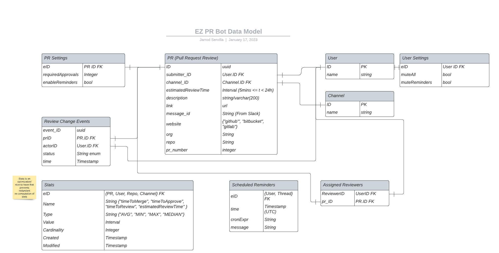
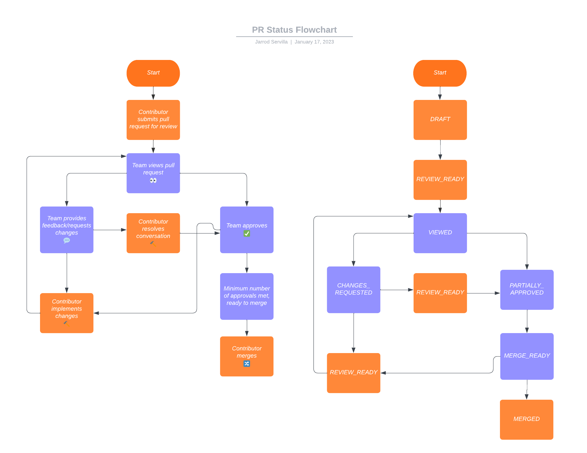
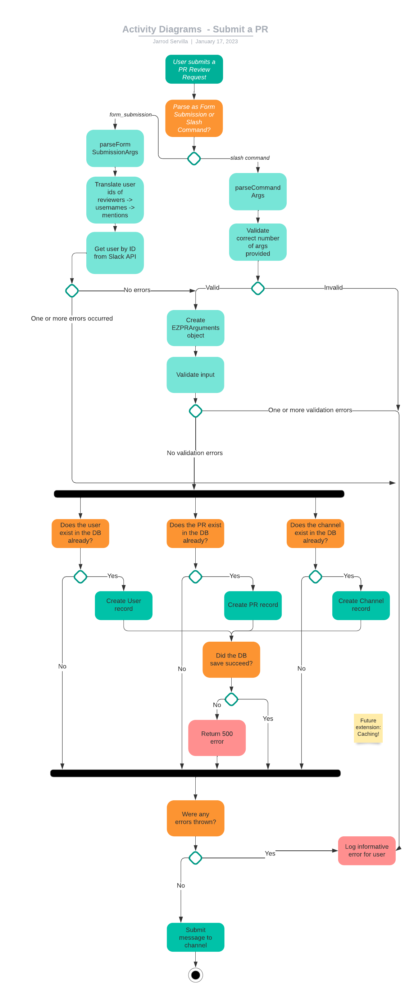

<h1 align="center">PR Review Request Tracker API - System Design</h1>

**We'll cover the following:**

* [System Requirements](#system-requirements)
* [Entity-Relationship Diagram](#entity-relationship-diagram)
* [PR Review Lifecycle](#pr-review-lifecycle)
* [Activity Diagrams](#activity-diagrams)
    * [Submit PR](#submit-pr)
    * [Statistics](#statistics)
* [Code](#code)

## System Requirements

Our PR Review Request Tracker API should meet the following requirements:

1. Users should be able to submit pull request reviews
2. Pull Requests can have one of the following statuses: "IN_REVIEW", "CHANGES_REQUESTED", "MERGE_READY", "MERGED"
3. Pull Request status can be updated by reacting to the message with the designated emoji.
4. Users can view statistics about (a single/their/their team's) PR review request(s), namely time-to-merge, time-to-approve, estimated-review-time, actual-review-time
5. It should be able to list (open/closed/all) PR review requests for a (individual/team).
6. Users can send reminders to (assigned reviewers/specified users)
7. Users can assign reviewers or assign themselves as a reviewer to a PR Review Request

## Entity-Relationship Diagram

    
     
    Entity Relationship Diagram

## PR Review Lifecycle

    
     
    PR Review Lifecycle

Note: There are no restrictions on state transitions. 
This is because team members may forget to react and we don't have control over the source of truth (Github/Gitlab/Bitbucket),
thus statistics are calculated on a best-effort basis.

## Activity Diagrams

### Submit PR

> As a user, I would like to submit a pull request review request as a (slash command/form submission) to solicit a review from my team.

    
     
    Submit PR Activity Diagram

### Reactions

> As a user, I would like to react with emojis to PR review requests so that I can communicate to my team and calculate statistics based on Review Change Events.

TODO

### Statistics

> As a user, I would like to view statistics about (my/my team/a singular) PR review request(s) so that I can
be informed on the PR review request process.

TODO

### List

> As a user, I would like to list (my/my team's) open PR review requests so that I can track the status of any
open PR review requests.

TODO
